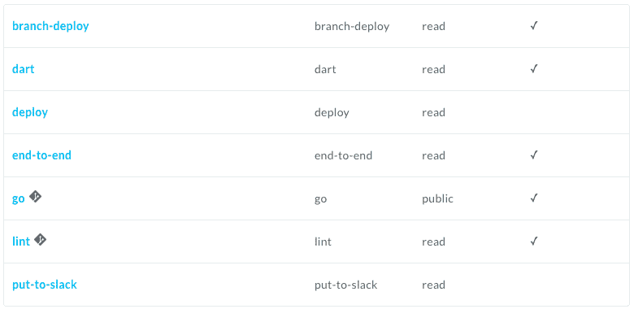
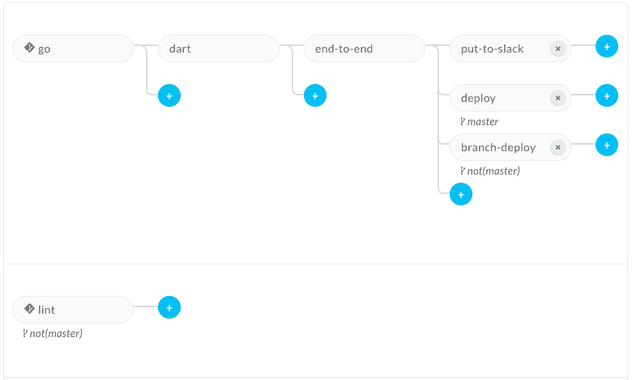

# boilerplate

# Install
Use `go get -u github.com/michilu/boilerplate`.

Or, if requires [Go modules](https://github.com/golang/go/wiki/Modules) (go1.11 and higher), as below.

```console
go get -d github.com/michilu/boilerplate
cd $(go env GOPATH)/src/github.com/michilu/boilerplate
GO111MODULE=on go install
```

# build

```console
make
```

```console
make gopherjs
```

# develop

```console
make serve
```

# deploy

```console
make deploy
```

# environment variables for Wercker

see: https://app.wercker.com/<organization\>/<application\>/environment

- `FIREBASE_PROJECT`: needs by the deploy step. see: https://console.firebase.google.com/
- `FIREBASE_TOKEN`: needs by the deploy step, via `$(firebase login:ci)`. see: https://github.com/firebase/firebase-tools#using-with-ci-systems
- `NETLIFY_BRANCH_DEPLOY_SITE_ID`: `API ID(UUID4)` on https://app.netlify.com/sites/<site-name\>/settings/general
- `NETLIFY_TOKEN`: https://app.netlify.com/account/applications/personal
- `SLACK_TOKEN`: needs by the ['slackcli'](https://github.com/cixtor/slackcli) command. see: https://api.slack.com/custom-integrations/legacy-tokens
- `SLACK_URL`: needs by the 'slack-notifier' step. see: https://slack.com/apps/A0F7XDUAZ-incoming-webhooks

# setup the workflows on Wercker

see: https://app.wercker.com/<organization>/<application>/workflows




# tools
- [PlantUML Editor](https://plantuml-editor.kkeisuke.com/)
- [XML Pretty Print](https://jsonformatter.org/xml-pretty-print)

# optimize

- https://github.com/gopherjs/gopherjs/wiki/JavaScript-Tips-and-Gotchas<Paste>
  - https://github.com/cathalgarvey/fmtless

1. minify: https://github.com/gopherjs/gopherjs#performance-tips

:

    7,196,874 bytes:  100%:   $ gopherjs build
    4,661,791 bytes:   65%:   $ gopherjs build --minify

2. UglifyJS 3: https://github.com/mishoo/UglifyJS2

:

    4,547,810 bytes:   63%:   $ gopherjs build --minify && uglifyjs
    4,274,152 bytes:   59%:   $ gopherjs build --minify && uglifyjs --compress
    3,843,890 bytes:   53%:   $ gopherjs build --minify && uglifyjs --compress --mangle

# sync to upstream

Add upstream:
```console
git clone git@github.com:michilu/boilerplate.git .
git remote add upstream https://github.com/dart-lang/angular.git
git checkout upstream/master
git subtree split --prefix=examples/hacker_news_pwa -b examples/hacker_news_pwa
```

Sync to upstream:
```console
git fetch upstream master
git checkout upstream/master
git subtree push --prefix=examples/hacker_news_pwa origin examples/hacker_news_pwa
git checkout upstream
git subtree pull --prefix=app origin examples/hacker_news_pwa
```

## ref
- https://github.com/dart-lang/angular/tree/master/examples/hacker_news_pwa
